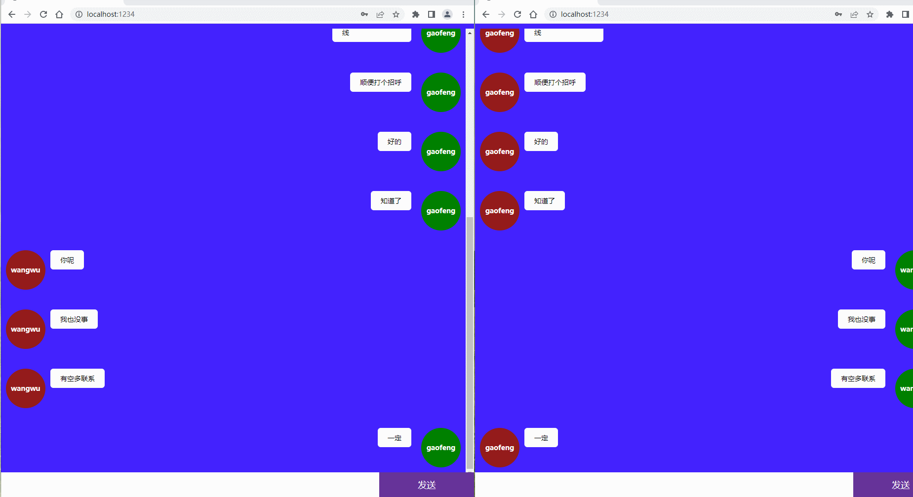

# socket.io 之聊天室实战

主要实现了聊天室的登录，注册，以及群聊的功能,没有使用 vue,react 框架，用的 jquery 实现，parcel 打包编译成静态资源

## 项目结构

```js
parceldemo
├─ .proxyrc
├─ package copy.json
├─ package-lock.json
├─ package.json
├─ src
│ ├─ app.js
│ ├─ app2.js
│ ├─ chat.html
│ ├─ css
│ │ ├─ index.css
│ │ └─ reset.scss
│ ├─ imgs
│ │ ├─ a1.jpg
│ │ └─ a2.jpg
│ ├─ index.html
│ ├─ server copy.js
│ ├─ server.js
│ └─ utils
│ ├─ jquery.min.js
│ ├─ mysql.js
│ └─ socket.io.js
└─ yarn.lock

```

## 效果展示

<p align="center">
    
</p>
<p align="center">
    
</p>

## 前置配置文件

```json
{
  "name": "parceldemo",
  "version": "1.0.0",
  "source": ["./src/index.html", "./src/chat.html"],
  "scripts": {
    "dev": "parcel",
    "build": "parcel build",
    "watch": "parcel watch"
  },
  "dependencies": {
    "jquery": "^3.6.4",
    "mysql": "^2.18.1",
    "nodemon": "^2.0.22",
    "socket.io": "^4.6.1",
    "socket.io-client": "^4.6.1"
  },
  "devDependencies": {
    "@parcel/transformer-sass": "2.8.3",
    "assert": "^2.0.0",
    "browserify-zlib": "^0.2.0",
    "buffer": "^5.5.0",
    "crypto-browserify": "^3.12.0",
    "events": "^3.1.0",
    "parcel": "^2.8.3",
    "path-browserify": "^1.0.0",
    "process": "^0.11.10",
    "punycode": "^1.4.1",
    "querystring-es3": "^0.2.1",
    "stream-browserify": "^3.0.0",
    "stream-http": "^3.1.0",
    "timers-browserify": "^2.0.11",
    "url": "^0.11.0",
    "util": "^0.12.3"
  },
  "@parcel/bundler-default": {
    "minBundles": 1,
    "minBundleSize": 3000,
    "maxParallelRequests": 20
  },
  "keywords": [],
  "author": "",
  "license": "ISC",
  "description": ""
}
```

## proxy 处理

根目录下的.proxyrc,parcel 打包工具的配置

```json
{
  "/api": {
    "target": "http://localhost:8080/",
    "pathRewrite": {
      "^/api": ""
    }
  }
}
```

## 入口

./src/index.html

```html
<!DOCTYPE html>
<html lang="en">
  <head>
    <meta charset="UTF-8" />
    <meta http-equiv="X-UA-Compatible" content="IE=edge" />
    <meta name="viewport" content="width=device-width, initial-scale=1.0" />
    <title>Document</title>
    <link rel="stylesheet" href="./css/index.css" />
  </head>
  <body>
    <div class="login-form">
      <h2 class="title">登录表单</h2>
      <label for="username">用户名：</label
      ><input id="username" type="text" name="username" value="" /> <br />
      <label for="password">密码：</label>
      <input id="password" type="password" name="pwd" value="" /> <br />
      <button class="btn" id="btnrReg">注 册</button>
      <button class="btn" id="btnLgn">登 录</button>
    </div>
    <div class="chat">
      <ul id="content"></ul>
      <textarea name="" id="txtArea" cols="30" rows="10"></textarea>
      <button id="send">发送</button>
    </div>
  </body>
  <!-- <script type="module" src="app.js"></script> -->
  <script type="module" src="./app2.js"></script>
</html>
```

<p align="center">
    
</p>

## mysql 数据

```js
const mysql = require('mysql')

function OptPool() {
  this.flag = true //是否连接过
  this.pool = mysql.createPool({
    host: 'localhost',
    user: 'root',
    port: 3306,
    password: '123456',
    database: 'db1'
  })

  this.getPool = function () {
    return this.pool
  }
}

module.exports = OptPool
```

## 客户端代码

app2.js

```js
import $ from 'jquery'
import io from 'socket.io-client'

// let socket = io('ws://192.168.1.104:8080')
let socket = io('ws://192.168.1.18:8080')

console.log(socket, 'socket')
socket.on('connect', () => {
  console.log(socket.id) // 输出客户端的id
})
$(function () {
  let cur_username = '',
    msg = '',
    oUl = $('#content')
  $('#btnrReg').click(function () {
    let username = $('#username').val()
    let password = $('#password').val()
    socket.emit('reg', { username, password })
    socket.on('reg_ret', (data) => {
      console.log(data, 'code')
      if (data.code == 1) {
        alert('注册失败：' + data.msg)
      } else {
        alert('注册成功：' + data.msg)
      }
    })
  })
  $('#btnLgn').click(function () {
    let username = $('#username').val()
    let password = $('#password').val()
    socket.emit('login', { username, password })
    socket.on('lgn_ret', (data) => {
      console.log(data, 'code')
      if (data.code == 1) {
        alert('登录失败：' + data.msg)
      } else {
        alert('登录成功：' + data.msg)
        cur_username = username
        localStorage.setItem('cur_username', cur_username)
        // $(location).attr('href', '/chat.html')
        $('.login-form').hide()
        $('.chat').show()
      }
    })
  })

  $('#txtArea').bind('keypress', function (event) {
    if (event.keyCode == '13') {
      submit()
    }
  })
  $('#send').click(function () {
    submit()
  })

  socket.on('msg_ret', (data) => {
    if (data.code == 1) {
      alert('信息发送失败')
    } else {
      // console.log('msg_ret', data)
      let oLi = document.createElement('li')
      oLi.className = 'mine'
      oLi.innerHTML = `<p>${msg}</p><h4>${cur_username}</h4>`
      oUl.append(oLi)
      $('#txtArea').val('')
    }
  })
  socket.on('msg', (data) => {
    console.log('msg', data)
    let oLi = document.createElement('li')
    oLi.className = 'others'
    oLi.innerHTML = `<h4>${data.cur_userName}</h4><p>${data.msg}</p`
    oUl.append(oLi)
  })
  socket.on('logout_ret', (data) => {
    alert(data.msg)
  })

  function submit() {
    msg = $('#txtArea').val()
    if (!msg.trim()) {
      return
    }
    socket.emit('msg', { cur_username, msg })

    var h4 = $('#content').prop('scrollHeight') //等同 $('#content')[0].scrollHeight
    // $('.out-box').scrollTop(h4)
    console.log(h4, 'h4')
    //移动到对话框底部
    $('#content').animate({ scrollTop: 9999 }, 1000)
  }
})
```

## 服务端 server.js

<p align="center">
    
</p>

```js
const http = require('http')
const fs = require('fs')
const { Server } = require('socket.io')
const url = require('url')
const OptPool = require('./utils/mysql')
const reg = /^\w{6,32}$/
const optPool = new OptPool()
const db = optPool.getPool()
let httpServer = http.createServer((req, res) => {
  res.setHeader('Access-Control-Allow-Origin', '*')
  res.end('ok')
})

const wsSocket = new Server(httpServer, { cors: true })
// const wsSocket = io.listen(httpServer)
let cur_userId = 0,
  cur_userName = ''
let allSockets = []
wsSocket.on('connection', (sock) => {
  sock.on('reg', (res) => {
    // console.log(res, 'res')

    if (!reg.test(res.username) || !reg.test(res.password)) {
      sock.emit('reg_ret', { code: 1, msg: '用户名或密码不符合规范' })
    } else {
      db.getConnection((err, conn) => {
        let sqlSearch = `select * from user_table WHERE username = ?`
        let insetSql = `insert into user_table (username,password,online) values(?,?,0)`
        let parmas1 = [`${res.username}`]
        db.query(sqlSearch, parmas1, (err, docs) => {
          // console.log('insetSql222')
          if (err) {
            sock.emit('reg_ret', { code: 1, msg: '数据库有误' })
          } else if (docs.length > 0) {
            sock.emit('reg_ret', { code: 1, msg: '此用户名已经存在' })
          } else {
            let params = [`${res.username}`, `${res.password}`]
            db.query(insetSql, params, function (err, docs) {
              if (err) {
                sock.emit('reg_ret', { code: 1, msg: '数据库错误' })
              } else {
                sock.emit('reg_ret', { code: 0, msg: '插入成功' })
              }
              conn.release() //放回连接池
            })
          }
        })
      })
    }
  })
  allSockets.push(sock)
  sock.on('login', (res) => {
    console.log(res, 'res')
    if (!reg.test(res.username) || !reg.test(res.password)) {
      sock.emit('lgn_ret', { code: 1, msg: '用户名或密码不符合规范' })
    } else {
      db.getConnection((err, conn) => {
        let sqlSearch = `select * from user_table WHERE username = ?`
        let updateSql = `update user_table set online=1 where id=?`

        let parmas1 = [`${res.username}`]
        db.query(sqlSearch, parmas1, (err, docs) => {
          // console.log('insetSql222')
          if (err) {
            sock.emit('lgn_ret', { code: 1, msg: '数据库有误' })
          } else if (docs.length == 0) {
            sock.emit('lgn_ret', { code: 1, msg: '此用户不存在' })
          } else {
            let params = [`${res.username}`, `${res.password}`]
            let params2 = [docs[0].id]
            cur_userId = docs[0].id
            cur_userName = docs[0].username
            db.query(updateSql, params2, (err, docs) => {
              if (err) {
                sock.emit('lgn_ret', { code: 1, msg: '数据库有误' })
              } else {
                sock.emit('lgn_ret', { code: 0, msg: '登录成功' })
              }
            })
          }
        })

        conn.release()
      })
    }
  })

  sock.on('msg', (res) => {
    console.log(res, 'msg')
    if (!res) {
      sock.emit('msg_ret', {
        code: 1,
        msg: '消息文本不能为空'
      })
    } else {
      //广播事件
      allSockets.forEach((ele) => {
        if (ele == sock) return

        ele.emit('msg', {
          code: 0,
          msg: res.msg,
          cur_userName: res.cur_username
        })
      })
      sock.emit('msg_ret', {
        code: 0,
        msg: '发送成功'
      })
    }
  })

  sock.on('disconnect', () => {
    console.log('退出')
    let params3 = [cur_userId]
    db.getConnection((err, conn) => {
      let updateSqlOffLine = `update user_table set online=0 where id=?`
      db.query(updateSqlOffLine, params3, (err, docs) => {
        if (err) {
          console.log('数据库有误')
        } else {
          sock.emit('logout_ret', { code: 0, msg: `${cur_userName}退出` })
          cur_userName = ''
          cur_userId = ''

          allSockets = allSockets.filter((ele) => ele != sock)
        }
      })
    })
  })
})

httpServer.listen(8080)
```

## 彩蛋

附上仓库使用方式

```bash
## 使用方式

- git clone

- yarn

- cd 项目

- yarn dev 启动前端

- nodemon ./server.js 启动本地数据客

## 注意

ws 链接的 ip 换成自己的 ip 就可以了
```
