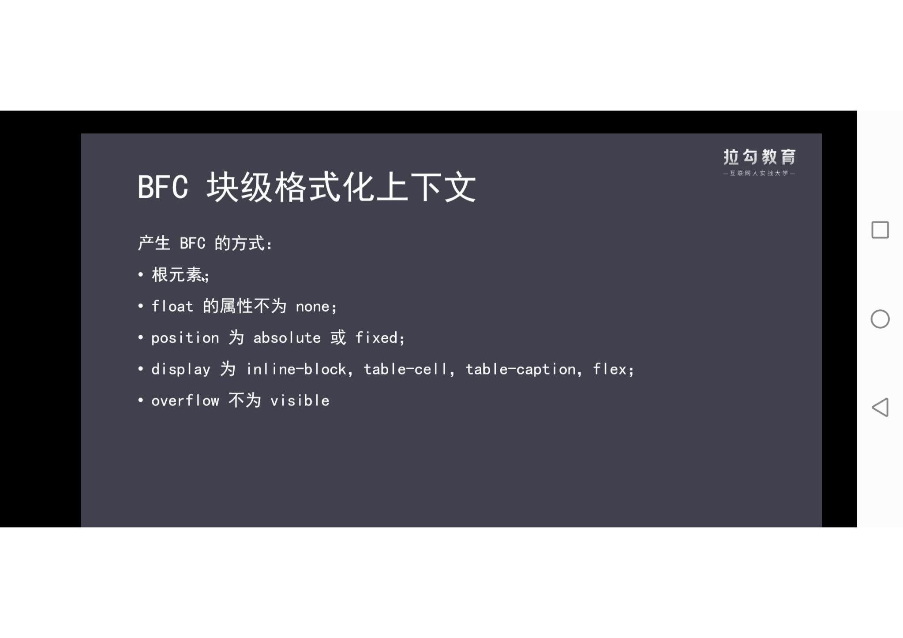

# 块级格式化上下文

## 定义

BFC（Block formatting context），即块级格式化上下文，它作为 HTML 页面上的一个独立渲染区域，只有区域内元素参与渲染，且不会影响其外部元素。

在一个 Web 页面的 CSS 渲染中，块级格式化上下文 （Block Fromatting Context）是按照块级盒子布局的。

## W3C 对 BFC 的定义

浮动元素和绝对定位元素，非块级盒子的块级容器（例如 inline-blocks，table-cells 和 table-captions），以及 overflow 值不为 “visiable” 的块级盒子，都会为他们的内容创建新的 BFC（块级格式上下文）。

## BFC 的触发条件

- 根元素，即 HTML 元素。
- float 除了 none 以外的值。
- position 的值为 absolute 或 fixed，不是 static 或者 relative。
- display 的值是 inline-block、table-cell、flex、table-caption 或者 inline-flex 。
- overflow 除了 visible 以外的值（hidden，auto，scroll ）

## BFC 的布局规则

- BFC 就是页面上的一个隔离的独立容器，容器里面的子元素不会影响到外面的元素。反之也如此。

- 内部的 Box 会在垂直方向，一个接一个地放置。

- Box 垂直方向的距离由 margin 决定。属于同一个 BFC 的两个相邻 Box 的 margin 会发生重叠。

- 每个盒子（块盒与行盒）的 margin box 的左边，与包含块 border box 的左边相接触(对于从左往右的格式化，否则相反)。即使存在浮动也是如此。

- BFC 的区域不会与 float box 重叠（可以用此来解决自适应布局的问题）。

- 计算 BFC 的高度时，浮动元素也参与计算（撑开父元素，不会出现高度塌陷问题）。

## BFC 的应用

- 利用 BFC 避免外边距重叠
- 利用 BFC 清除浮动
- 自适应两栏布局

参考链接:[详解 BFC：块级格式化上下文](https://blog.csdn.net/icemwj/article/details/120625370)
