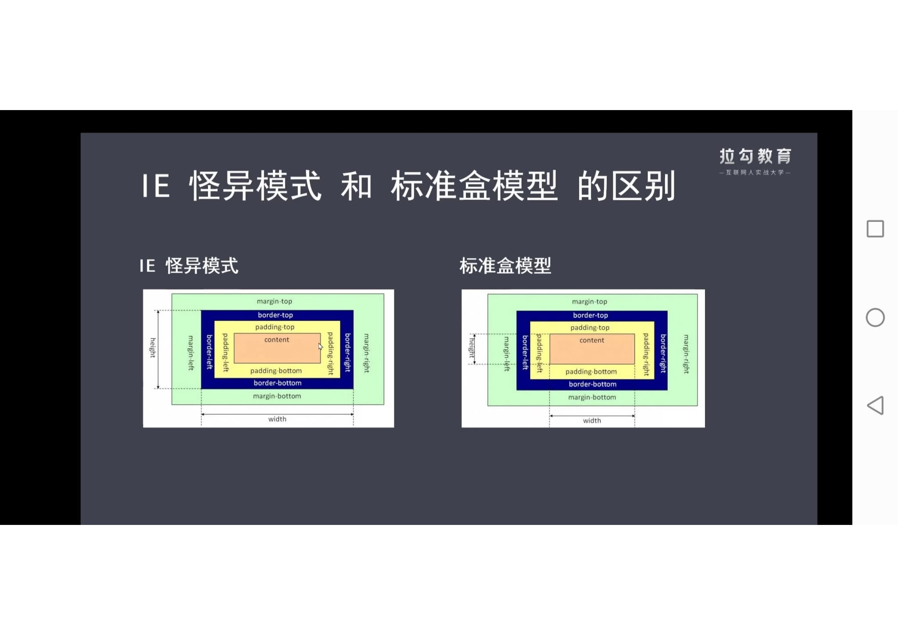

# 盒模型

## 盒子模型复习

盒模型有两种，除了经常见到的标准盒模型之外，还有怪异盒模型（IE 怪异模式）。**二者的区别是 content 的大小不同。**

- **标准盒模型**大小=contentWidth(宽高)+padding+border+margin
- **怪异盒模型**大小=宽高=contentWidth+margin (contentWidth=padding+border)

也就是说，在标准盒模型中，增加 padding 等属性后，盒模型会外扩；而怪异盒模型中，则不会外扩，但 content 区域会内缩。其中 margin 是盒模型所占的空间，不参与内容宽高计算

## 怎样自由选择采用哪种盒模型？

通过 box-sizing 属性

|         标准盒模型         |    怪异盒模型     |
| :------------------------: | :---------------: |
| content-box 属性值（默认） | border-box 属性值 |

> 备注： margin 不计入实际大小 —— 当然，它会影响盒子在页面所占空间，但是影响的是盒子外部空间。盒子的范围到边框为止 —— 不会延伸到 margin。

页面渲染时，dom 元素所采用的 布局模型。可通过 box-sizing 进行设置。
根据计算宽高的区域可分为：

- content-box (W3C 标准盒模型)
- border-box (IE 盒模型)
- padding-box (FireFox 曾经支持)
- margin-box (浏览器未实现)

> Tips: 理论上是有上面 4 种盒子，但现在 w3c 与 mdn 规范中均只支持 content-box 与 border-box；

参考链接 1：[css 盒模型](https://mp.weixin.qq.com/s?__biz=MjM5MDA2MTI1MA==&mid=2649093824&idx=3&sn=b9b70526eb6c5780e712b5d9da27492d&chksm=be5bd16d892c587b8e36fdc5c5796f16b35cbe025d1a3cad7df9815a893dcef12895bed63050&scene=27)

参考链接 2：[玩转盒模型](https://developer.mozilla.org/zh-CN/docs/Learn/CSS/Building_blocks/The_box_model#%E7%8E%A9%E8%BD%AC%E7%9B%92%E6%A8%A1%E5%9E%8B)
