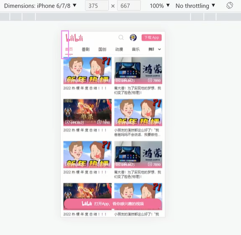
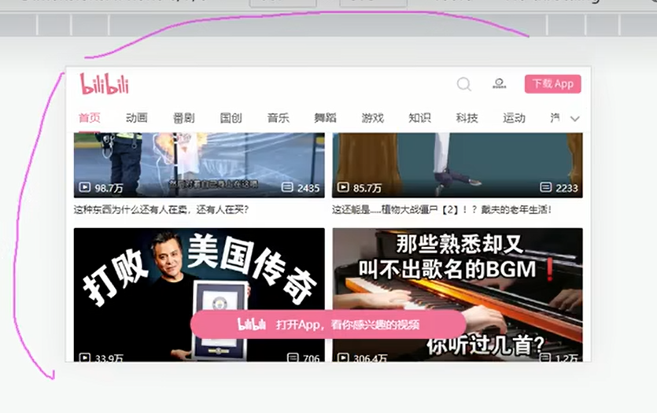

# b 站移动端为什么用 vmin 不用 vw

## 定义

- vmin 可以照顾到移动端横屏和竖屏的显示效果

- vh 和 vw 与视口的高度和宽度有关，1vw 就是视口宽度的 1%
- vmin 和 vmax 是与当下屏幕的宽度和高度的最大值或最小值有关，取决于哪个更大和更小

## 效果对比

- vw/vmin 竖屏显示
  

- vw 横屏显示
  

**明显看出头部区域比例太大**

- vmin 横屏
  

## 替换方法

比较简单，直接将之前写好的 vw 替换成 vmin
