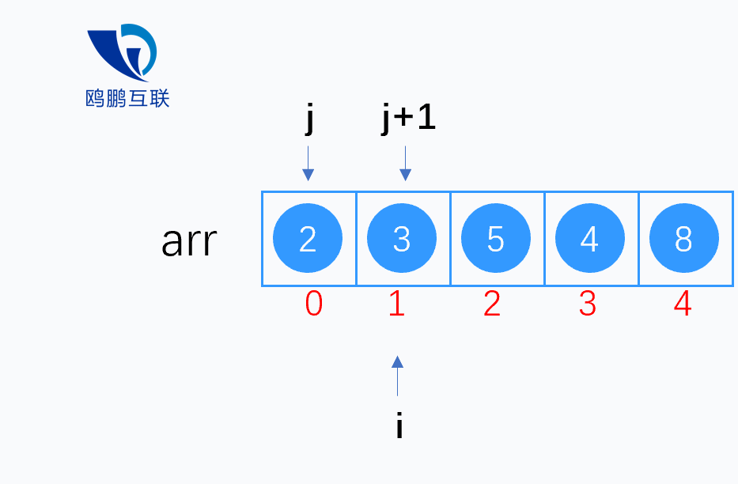

# 冒泡排序

**不推荐该算法，它的复杂度是 O(n2)。**

[](../images/mp.gif)

## 定义

学冒泡算法，因为它在所有排序算法中最简单。然而，从运行时间的角度来看，冒泡排序是最差的一个，接下来你会知晓原因。

冒泡排序比较任何两个相邻的项，如果第一个比第二个大，则交换它们。元素项向上移动至
正确的顺序，就好像气泡升至表面一样，冒泡排序因此得名。

```js
//冒泡排序
this.bubbleSort = function () {
  for (let i = 0, len = array.length; i < len; i++) {
    for (let j = 0, len = array.length - 1; j < len; j++) {
      let now = array[j]
      let next = array[j + 1]
      if (now > next) {
        //如果当前元素比下一项大就交换两个元素
        swap(array, j, j + 1)
      }
    }
  }
}
```

## 完整 demo 代码

```js
//创建一个数组

function ArrayList() {
  let array = []
  const swap = function (array, index1, index2) {
    let temp = array[index1]
    array[index1] = array[index2]
    array[index2] = temp

    //es6的方法
    /* [ array[index1], array[index2]] = [ array[index2], array[index1]] */
  }
  this.insert = function (item) {
    array.push(item)
  }
  this.toString = function () {
    return array.join('')
  }
  //冒泡排序
  this.bubbleSort = function () {
    let len = array.length
    for (let i = 0; i < len; i++) {
      for (let j = 0; j < len - 1; j++) {
        let now = array[j]
        let next = array[j + 1]
        if (now > next) {
          swap(array, j, j + 1)
        }
      }
    }
  }
  //改进版本
  this.modifiedBubbleSort = function () {
    var length = array.length
    for (var i = 0; i < length; i++) {
      //如果从内循环减去外循环中已跑过的轮数，就可以避免内循环中所有不必要的比较
      for (var j = 0; j < length - 1 - i; j++) {
        if (array[j] > array[j + 1]) {
          swap(j, j + 1)
        }
      }
    }
  }
}

function createNonSortedArray(size) {
  var array = new ArrayList()
  for (var i = size; i > 0; i--) {
    array.insert(i)
  }
  return array
}

const demo1 = createNonSortedArray(6)
console.log(demo1.toString()) //654321
demo1.bubbleSort()
console.log(demo1.toString()) //123456
```
