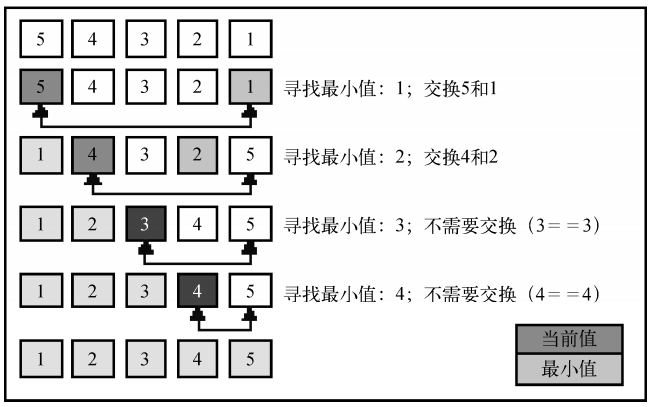

# 选择排序

**复杂度为 O(n2)**

[](../images/select.png)

## 定义

选择排序算法是一种原址比较排序算法。选择排序大致的思路是找到数据结构中的最小值并将其放置在第一位，接着找到第二小的值并将其放在第二位，以此类推。

## 代码

```js
//选择排序
this.selectionSort = function () {
  let len = array.length,
    indexMin
  for (let i = 0; i < len; i++) {
    indexMin = i
    for (let j = i; j < len; j++) {
      if (array[indexMin] > array[j]) {
        indexMin = j
      }
    }
    if (i != indexMin) {
      swap(array, i, indexMin)
    }
  }
}
```

## 完整代码

```js
//创建一个数组

function ArrayList() {
  let array = []
  const swap = function (array, index1, index2) {
    let temp = array[index1]
    array[index1] = array[index2]
    array[index2] = temp

    //es6的方法
    /* [ array[index1], array[index2]] = [ array[index2], array[index1]] */
  }
  this.insert = function (item) {
    array.push(item)
  }
  this.toString = function () {
    return array.join('')
  }
  //选择排序
  this.selectionSort = function () {
    let len = array.length,
      indexMin
    for (let i = 0; i < len; i++) {
      indexMin = i
      for (let j = i; j < len; j++) {
        if (array[indexMin] > array[j]) {
          indexMin = j
        }
      }
      if (i != indexMin) {
        swap(array, i, indexMin)
      }
    }
  }
}

function createNonSortedArray(size) {
  var array = new ArrayList()
  for (var i = size; i > 0; i--) {
    array.insert(i)
  }
  return array
}

const demo1 = createNonSortedArray(6)
console.log(demo1.toString()) //654321
demo1.selectionSort()
console.log(demo1.toString()) //123456
```
