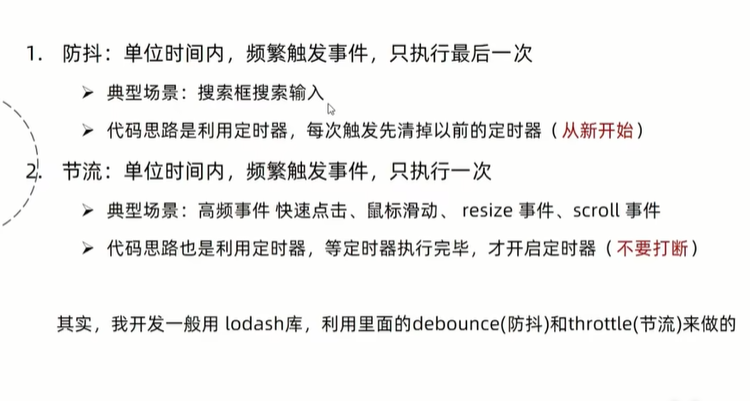

# js 里面的防抖与节流



## 防抖

- 定义

  就是指连续出发事件，但是在设定的时间内，如果再次触发的话，之前的计时就作废，**从新开始计时**

- 应用场景

  1. 搜索框输入搜索
  2. 文本编辑器实时保存

## 实例代码:搜索框输入搜索

```js
window.onload = function () {
  //   document.getElementById('ipt').onkeyup = function (e) {
  //     console.log(e.target.value)
  //   }
  document.getElementById('ipt').onkeyup = (e) =>
    debounce(() => console.log(e.target.value), 3000)()
}

function debounce(fn, ms) {
  let timeId = null
  return function () {
    if (timeId != null) {
      clearTimeout(timeId)
    }
    console.log(this, 'this')
    timeId = setTimeout(() => {
      // fn.apply(this, arguments)
      fn.apply(this)
    }, ms)
  }
}
```

## 节流

- 定义

  单位时间内，频繁触发，我只执行一次
  **不要打断我，无论触发多少次我只执行一次**

  高频事件 快速点击，鼠标滑动，resize，scroll  
  下拉加载  
  视频播放记录时间

```js
window.onload = function () {
  document.addEventListener(
    'mousemove',
    throttle(() => {
      console.log('move')
    }, 3000)
  )
}

function throttle(fn, ms) {
  let timeId = null
  return function () {
    if (timeId != null) {
      return
    }
    timeId = setTimeout(() => {
      fn.apply(this)
      timeId = null
    }, ms)
  }
}
```

[视频讲解](https://www.bilibili.com/video/BV1dv4y117mY/?spm_id_from=pageDriver&vd_source=5f704a73611cba40b8f8f7d423e9ee2a)
