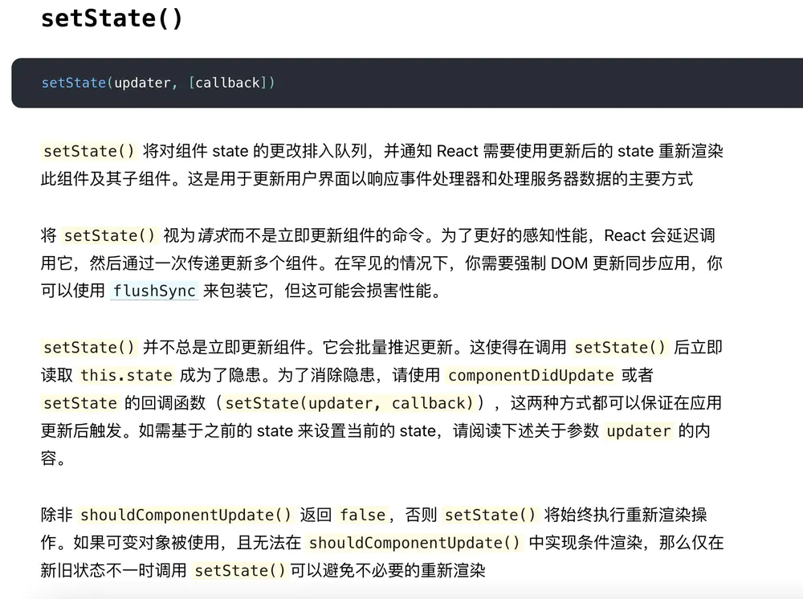

# React 中的 setState 是异步的吗？



1. setState 是同步执行的！但是 state 并不一定会同步更新（异步更新和同步更新都存在）

```
setState 只在合成事件和钩子函数中是“异步更新”的。
```

异步更新的背后，是同步代码处理（"合成事件和钩子函数"的调用在"更新"之前）。  
异步是为了实现批量更新的手段，也是 React 性能优化的一种方式。

2. React.setState()中的同步更新

当然，也是有办法同步获取 state 更新后的值：

```
- setTimeout 等异步操作中调用 setState 函数
- DOM 原生事件
- 利用 setState 回调函数
- 函数式 setState 用法
```

前两个都比较好理解，不会开启批量更新模式，那么，在上面的调用栈图示里面，会直接走到事务更新。
后面两个方法，是 React 本身提供的。要注意的是，setState 回调函数要在 render 函数被重新执行后才执行。

## 测试题

```js
import React from 'react'

class TestView extends React.Component {
  state = {
    count: 0
  }
  componentDidMount() {
    this.setState({
      count: this.state.count + 1
    })
    console.log('console: ' + this.state.count)

    this.setState({ count: this.state.count + 1 }, () => {
      console.log('console from callback: ' + this.state.count)
    })

    this.setState(
      (prevState) => {
        console.log('console from func: ' + prevState.count)
        return {
          count: prevState.count + 1
        }
      },
      () => {
        console.log('last console: ' + this.state.count)
      }
    )
  }

  render() {
    console.log('render' + this.state.count)
    return <h4>test</h4>
  }
}

export default TestView
```
