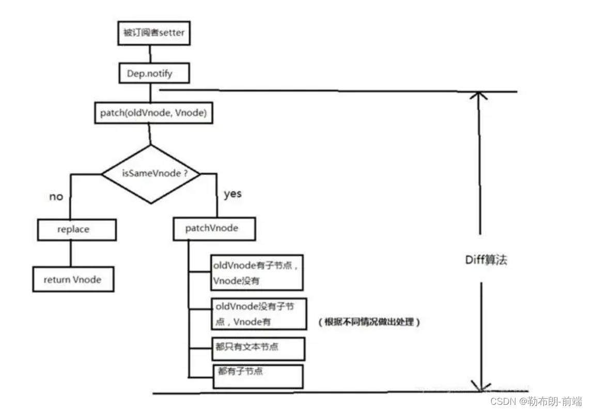
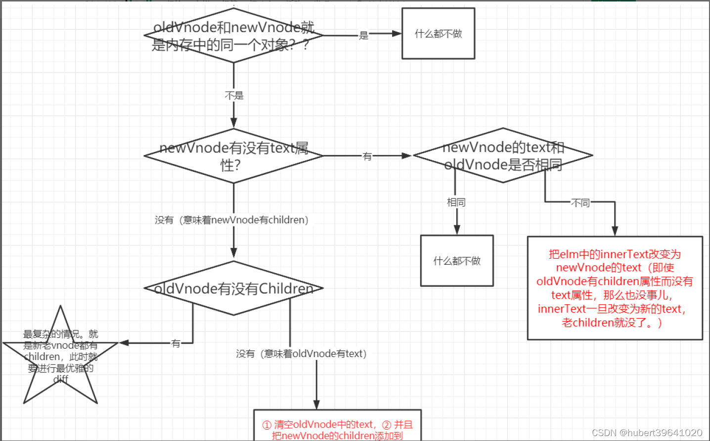

# Vue 里面的 diff

## 什么是 Diff 算法?

Diff 算法是一种对比算法，主要是对比旧的虚拟 DOM 和新的虚拟 DOM，找出发生更改的节点，并只更新这些接地那，而不更新未发生变化的节点，从而准确的更新 DOM，减少操作真实 DOM 的次数，提高性能。

## Diff 算法是深度优先还是广度优先？时间复杂度是多少？

Diff 算法是深度优先算法，时间复杂度是 O(n³)。

## 传统 Diff

> **循环递归每一个节点**  
> 将两颗树中所有的节点一一对比需要 O(n²)的复杂度，在对比过程中发现旧节点在新的树中未找到，那么就需要把旧节点删除，删除一棵树的一个节点(找到一个合适的节点放到被删除的位置)的时间复杂度为 O(n),同理添加新节点的复杂度也是 O(n),合起来 diff 两个树的复杂度就是 O(n³)

## Vue 中的 diff



当数据发生变化的时候，会触发 `setter`，然后通过 `Dep` 类的 `notify` 方法去通知所有的订阅者 `Watcher`，订阅者会调用 `patch` 方法。

`patch` 方法会通过 `sameVnode` 方法来判断当前同层的虚拟节点是否是同一种类型的节点，如果是则调用 `patchVnode` 方法，不是则直接替换成新的节点。
如果是同一类型的节点，`patchVnode` 会首先找到节点对应的真实 DOM，然后判断新旧节点是否是指向的同一个对象，如果是则直接 `return`。

如果不是则判断文本节点是否相等，不相等则将真实 DOM 的文本节点改为新节点的文本内容，然后看旧节点和新节点的子节点的关系，如果旧的有新的没有，则删除真实 DOM 的子节点，如果新有旧没有，则将虚拟节点真实化之后，添加上去，如果二者都有子节点则执行 `updateChildren` 函数比较子节点。



1. 新的头部子节点，旧的头部子节点
2. 新的尾部子节点，旧的尾部子节点
3. 新的尾部子节点，旧的头部子节点
4. 新的头部子节点，旧的尾部子节点
5. 如果条件 1 满足，新旧节点头部指针往后移。

如果条件 2 满足，新旧节点尾部指针往前移。判断是否新的子节点先循环完（头尾位置指针判断），是：就是删除了节点，否：新增了节点，新增的节点按照条件 4 添加

如果条件 3 满足，需要移动新的头部子节点到旧的尾部子节点后面

如果条件 4 满足，需要移动新的头部子节点到旧的头部子节点前面

如果 4 种都未匹配到，并且指针条件未满足，需要 loop 匹配

vue 在把被移动的节点和匹配的节点设置为 undefined

```js
function patch(oldVnode, vnode) {
  // some code
  if (sameVnode(oldVnode, vnode)) {
    patchVnode(oldVnode, vnode) //当结构一致时执行patchvnode函数
  } else {
    //当结构不一样时执行的操作就简单多了，将之前的文本节点替换掉就行
    const oEl = oldVnode.el // 当前oldVnode对应的真实元素节点
    let parentEle = api.parentNode(oEl) // 父元素
    createEle(vnode) // 根据Vnode生成新元素
    if (parentEle !== null) {
      //判断父元素是否为空
      api.insertBefore(parentEle, vnode.el, api.nextSibling(oEl)) // 将新元素添加进父元素
      api.removeChild(parentEle, oldVnode.el) // 移除以前的旧元素节点
      oldVnode = null //解除全局变量的引用，回收内存
    }
  }
  // some code
  return vnode //最后更新虚拟dom
}
```

那么接下来就分析结构一致的情况，那么什么情况下结构是一致的呢，看一下 samevnode 源码

```js
function sameVnode(a, b) {
  return (
    a.key === b.key && // key值一致
    a.tag === b.tag && // 标签名一致
    a.isComment === b.isComment && // 是否都为注释节点
    // 是否都定义了data，data包含一些具体信息，例如onclick , style
    isDef(a.data) === isDef(b.data) &&
    sameInputType(a, b) // 当标签是<input>的时候，type必须相同
  )
}
```

那这些都一致了的话我们就要看他们的内容（文本）和子节点了

```js
patchVnode (oldVnode, vnode) {
    const el = vnode.el = oldVnode.el
    let i, oldCh = oldVnode.children, ch = vnode.children
    if (oldVnode === vnode) return  //如果两个节点完全一样就直接return
    if (oldVnode.text !== null && vnode.text !== null && oldVnode.text !== vnode.text) {
        api.setTextContent(el, vnode.text) //如果是文本节点当两个节点的文本不为空并且不相等是，直接替换
    }else {
        updateEle(el, vnode, oldVnode)
        if (oldCh && ch && oldCh !== ch) {
            updateChildren(el, oldCh, ch)
        }else if (ch){
            createEle(vnode) //create el's children dom
        }else if (oldCh){
            api.removeChildren(el)
        }
    }
}
```

## React 的 diff 和 Vue 的 diff 算法的不同之处

vue 和 react 的 diff 算法都是进行同层次的比较，主要有以下两点不同：

vue 对比节点，如果节点元素类型相同，但是 className 不同，认为是不同类型的元素，会进行删除重建，但是 react 则会认为是同类型的节点，只会修改节点属性。
vue 的列表比对采用的是首尾指针法，而 react 采用的是从左到右依次比对的方式，当一个集合只是把最后一个节点移动到了第一个，react 会把前面的节点依次移动，而 vue 只会把最后一个节点移动到最后一个，从这点上来说 vue 的对比方式更加高效。

## 响应式原理

React 的响应式原理
React 主要是通过 setState()方法来更新状态，状态更新之后，组件也会重新渲染。

Vue 的响应式原理
vue 会遍历 data 数据对象，使用 Object.definedProperty()将每个属性都转换为 getter 和 setter，每个 Vue 组件实例都有一个对应的 watcher 实例，在组件初次渲染的时候会记录组件用到了那些数据，当数据发生改变的时候，会触发 setter 方法，并通知所有依赖这个数据的 watcher 实例调用 update 方法去触发组件的 compile 渲染方法，进行渲染数据。

参考链接：[vue 和 react 的 diff 比较](https://blog.csdn.net/weixin_51225684/article/details/128020753)
